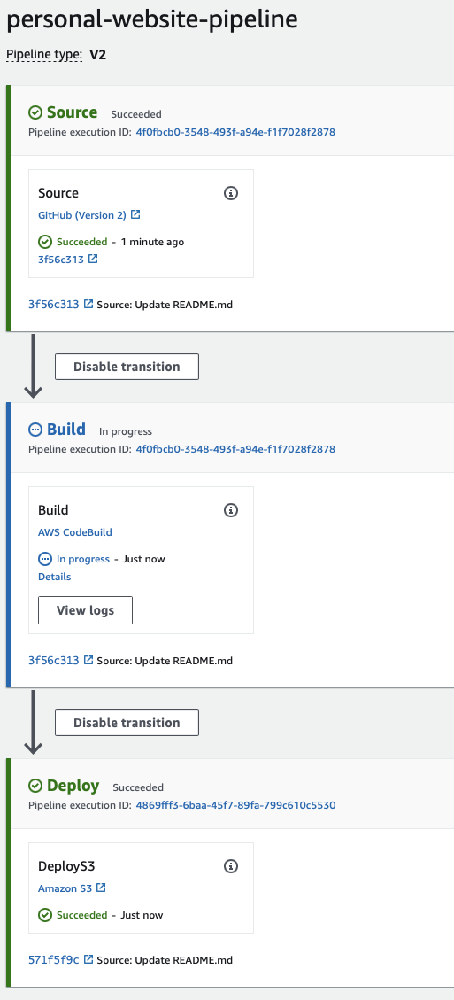

# Personal Website on AWS

## Introduction

## Purpose

## Features
|Step 1| Design Your Website|
|Step 2| Set Up Amazon S3 Bucket|
|Step 3| Routing static website to domain name using Route 53|
|Step 4| Deploy Static Website to AWS S3 with HTTPS using CloudFront|
|Step 5| Set up CI/CD on Amazon CodePipeline|

## Requirements
To host a static website on AWS, you need the following:

- An active AWS account with appropriate permissions to create and manage the required resources.
- Basic knowledge of AWS services, web development and programming concepts.

## Usage
Link to personal website: [www.benjaminlee28.com](https://www.benjaminlee28.com)

Pipeline created for Deployment

  

