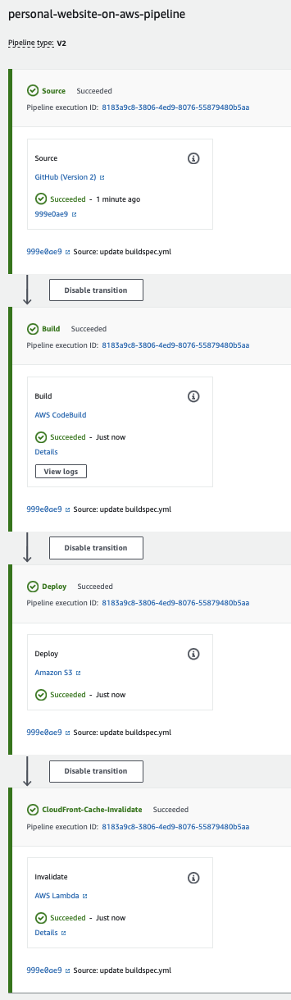

# Personal Website on AWS
## Introduction
In this guide, we will delve into the process of hosting a static website using a combination of AWS services: Amazon S3 for storage, Amazon CloudFront for content distribution, Route 53 for domain management, Lambda for serverless computing, and CodePipeline for continuous integration and deployment. Together, these services not only ensure your website is globally accessible with low latency but also automate the deployment process, ensuring your content is always up-to-date. 
## Features
| Steps | Tasks |
| ---- | ---- |
| Step 1 | Design Your Website |
|Step 2 | Set Up Amazon S3 Bucket |
|Step 3 | Routing static website to domain name using Route 53 |
|Step 4 | Deploy Static Website to AWS S3 with HTTPS using CloudFront |
|Step 5 | Set up CI/CD on Amazon CodePipeline |

## Requirements
To host a static website on AWS, you need the following:

- An active AWS account with appropriate permissions to create and manage the required resources.
- Basic knowledge of AWS services, web development and programming concepts.

## Usage
Link to personal website: [www.benjaminlee28.com](https://www.benjaminlee28.com)

Pipeline created for Deployment

  

